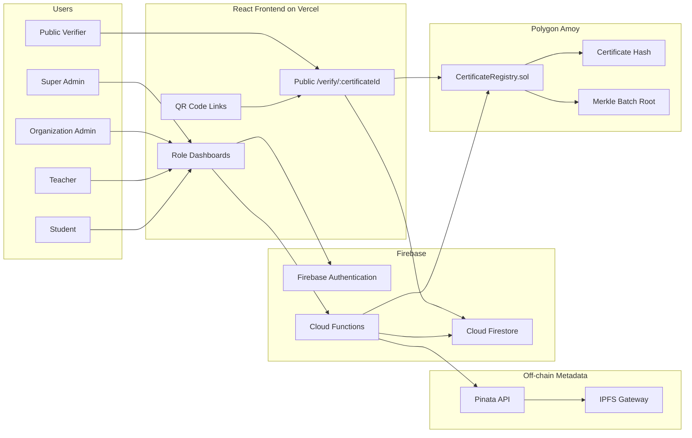
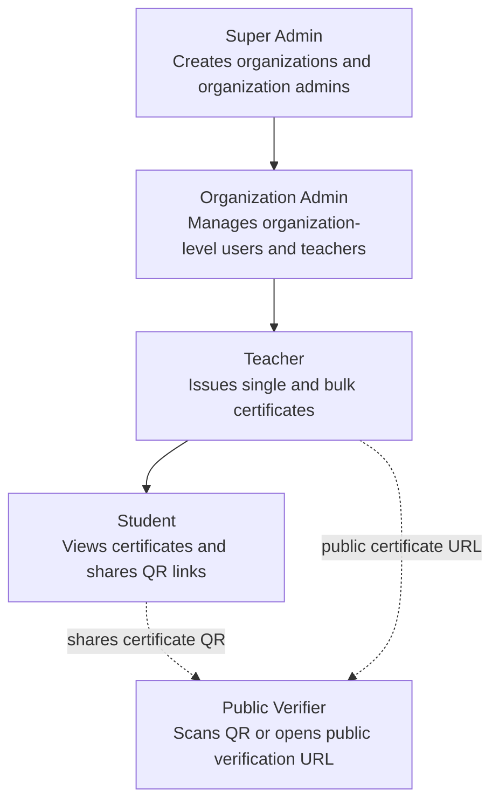
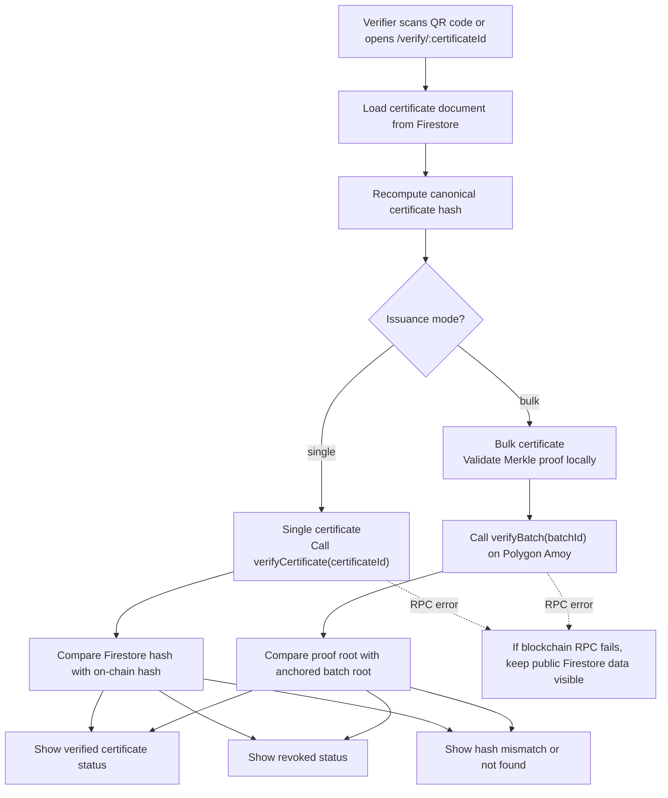

# BlockChain-Based-Certificate-Generation-Validation-and-Revocation-System-FYP


> A blockchain-based certificate verification platform with Firebase authentication, public QR verification, IPFS metadata storage, and gas-efficient Merkle tree batch issuance on Polygon Amoy.

**GitHub:** BlockChain-Based-Certificate-Generation-Validation-and-Revocation-System-FYP Repository

## Overview

**FYP-Blockchain-Rough** is a full-stack certificate issuance and verification system designed to reduce certificate fraud in academic and professional environments. Traditional certificate verification depends on manual calls, emails, database checks, or easily forged PDF/image documents. This creates delays for employers, institutions, and students, while fake credentials can circulate with little friction.

This project solves that problem by combining:

- **Firebase Authentication and Firestore** for secure application data, user roles, and dashboards.
- **Solidity smart contracts** on **Polygon Amoy** to anchor tamper-resistant certificate hashes and Merkle batch roots.
- **IPFS metadata storage through Pinata** so certificate metadata can be stored off-chain while still being referenced by immutable blockchain records.
- **QR-based public verification** so anyone can scan a certificate and verify it without logging in.
- **Merkle tree batch issuance** so many certificates can be represented by one on-chain root, reducing gas costs dramatically compared with issuing every certificate as a separate transaction.

The result is a practical verification workflow: organizations issue certificates, the backend computes canonical proof data, the blockchain stores either an individual certificate hash or a batch Merkle root, and public verifiers can independently confirm authenticity from a QR verification link.

## Features

- 🔐 **Role-based access control** for Super Admins, Organization Admins, Teachers, Students, and Public Verifiers.
- 🏫 **Organization management** for creating organizations and assigning organization administrators.
- 👨‍🏫 **Teacher workflows** for issuing single certificates and previewing bulk certificate batches.
- 📦 **Batch certificate issuance** using Merkle trees for scalable, gas-efficient anchoring.
- ⛓️ **Polygon Amoy smart contract integration** for certificate issuance, revocation, and batch root anchoring.
- 🧾 **Canonical certificate hashing** to detect tampering between Firestore data, IPFS metadata, and blockchain records.
- 🌐 **Public verification pages** at `/verify/:certificateId` with no login requirement.
- 📱 **QR code verification** for fast certificate sharing and scanning.
- 📌 **Pinata/IPFS metadata uploads** for decentralized certificate metadata references.
- 🔥 **Firebase Functions backend** for privileged writes, blockchain transactions, IPFS uploads, and email workflows.
- 📚 **Student dashboard** for viewing issued certificates and verification status.
- 🚫 **Revocation support** for blockchain-confirmed certificates and batches.
- 🚀 **Vercel-ready frontend routing** with SPA fallback support.

## Tech Stack

| Layer | Technology |
| --- | --- |
| Frontend | React, Vite, React Router, Firebase Web SDK |
| Backend | Firebase Cloud Functions, Firebase Admin SDK, Node.js |
| Database | Cloud Firestore |
| Authentication | Firebase Authentication |
| Blockchain | Solidity, Hardhat, ethers.js |
| Network | Polygon Amoy testnet |
| Storage | IPFS metadata through Pinata |
| Verification | QR codes, public verification URLs, Merkle proofs |
| Deployment | Vercel frontend, Firebase Functions backend |

## Architecture Overview



## Role-Based Architecture



## Smart Contract Features

The `CertificateRegistry` contract provides the on-chain trust layer for the system.

- **Authorized issuer management** through an owner-controlled issuer list.
- **Single certificate anchoring** with `issueCertificate(certificateId, certificateHash, ipfsCid)`.
- **Certificate verification** with `verifyCertificate(certificateId)`.
- **Certificate revocation** with irreversible revoked state.
- **Batch root anchoring** with `anchorBatch(batchId, batchRoot)`.
- **Batch verification** with `verifyBatch(batchId)`.
- **Batch revocation** for invalidating anchored Merkle batches.
- **Event logs** for issued, revoked, authorized, and batch-anchored activity.

The smart contract layer targets the deployed `CertificateRegistry` instance on **Polygon Amoy**. The active contract address and RPC credentials are supplied through environment variables and must not be committed.

## Merkle Tree Batch Issuance

Issuing certificates one by one can become expensive because every certificate requires a blockchain transaction. This project uses Merkle trees to optimize bulk issuance:

1. Each certificate is converted into a canonical certificate hash.
2. Hashes are used as Merkle leaves.
3. The backend builds a Merkle root and per-certificate proofs.
4. Only the Merkle root is anchored on-chain for the whole batch.
5. Each certificate stores its batch ID, root, index, proof, and batch size.
6. Public verification recomputes the certificate hash, validates the Merkle proof, and checks that the batch root is anchored on Polygon Amoy.

This keeps verification strong while reducing on-chain writes from **N transactions** to **one transaction per batch**.

## Project Structure

```text
.
├── blockchain/                  # Hardhat smart contract workspace
│   ├── contracts/
│   │   └── CertificateRegistry.sol
│   ├── scripts/
│   │   └── deploy.js
│   └── test/
│       └── CertificateRegistry.test.js
├── certificate-frontend/         # React + Vite frontend
│   ├── src/
│   │   ├── pages/                # Login, dashboards, public verification
│   │   ├── blockchain/           # Frontend blockchain read helpers
│   │   ├── components/           # Shared UI components
│   │   └── utils/                # QR, IPFS, PDF, sharing utilities
│   └── vercel.json               # SPA fallback for Vercel routing
├── functions/                    # Firebase Cloud Functions backend
│   ├── blockchain/               # Hashing, registry, Merkle helpers
│   ├── email/                    # Certificate email helpers
│   ├── ipfs/                     # Pinata/IPFS metadata upload
│   └── index.js                  # Callable Functions entrypoint
├── scripts/                      # Utility scripts
├── day1_starter_pack/            # Earlier reference/starter materials
├── firebase.json                 # Firebase Functions configuration
└── README.md
```

## Installation

Clone the repository and install dependencies for each workspace:

```bash
git clone <repository-url>
cd FYP-Blockchain-Rough

npm install

cd certificate-frontend
npm install

cd ../functions
npm install

cd ../blockchain
npm install
```

## Environment Variables

Create local environment files or Firebase secrets using placeholder values only. Do not commit real keys, private keys, JWTs, or RPC credentials.

### Frontend

The frontend uses Firebase client configuration and any public Vite variables required by the UI.

```bash
VITE_FIREBASE_API_KEY=<your-firebase-api-key>
VITE_FIREBASE_AUTH_DOMAIN=<your-firebase-auth-domain>
VITE_FIREBASE_PROJECT_ID=<your-firebase-project-id>
VITE_FIREBASE_STORAGE_BUCKET=<your-firebase-storage-bucket>
VITE_FIREBASE_MESSAGING_SENDER_ID=<your-firebase-sender-id>
VITE_FIREBASE_APP_ID=<your-firebase-app-id>
```

### Firebase Functions

Use Firebase secrets for backend-only values:

```bash
firebase functions:secrets:set BLOCKCHAIN_RPC_URL
firebase functions:secrets:set BLOCKCHAIN_PRIVATE_KEY
firebase functions:secrets:set CERTIFICATE_REGISTRY_ADDRESS
firebase functions:secrets:set BLOCKCHAIN_CHAIN_ID
firebase functions:secrets:set PINATA_JWT
firebase functions:secrets:set SENDGRID_API_KEY
```

Optional runtime configuration:

```bash
FRONTEND_BASE_URL=<your-frontend-url>
```

### Blockchain

For Hardhat deployment, create `blockchain/.env` locally:

```bash
BLOCKCHAIN_RPC_URL=<polygon-amoy-rpc-url>
BLOCKCHAIN_PRIVATE_KEY=<deployer-private-key>
BLOCKCHAIN_CHAIN_ID=80002
CERTIFICATE_REGISTRY_ADDRESS=<deployed-contract-address>
```

## Running Frontend

```bash
cd certificate-frontend
npm run dev
```

Common frontend commands:

```bash
npm run build
npm run preview
npm run lint
```

## Running Firebase Functions

```bash
cd functions
npm run serve
```

Deploy Functions after configuring Firebase secrets:

```bash
cd functions
npm run deploy
```

Useful Firebase commands:

```bash
firebase functions:log
firebase emulators:start --only functions
```

## Deploying Smart Contracts

Compile and test the contract:

```bash
cd blockchain
npm run compile
npm test
```

Deploy to Polygon Amoy:

```bash
cd blockchain
npx hardhat run scripts/deploy.js --network amoy
```

After deployment:

- Save the contract address as `CERTIFICATE_REGISTRY_ADDRESS`.
- Configure Firebase Functions secrets for blockchain access.
- Keep the deployed private key secure and never expose it in frontend code.
- Update copied ABI files only when the contract interface changes.

## Verification Flow



Public verifiers do not need an account. They can scan the QR code, open the verification link, and see whether the certificate is valid, revoked, missing on-chain, or mismatched.

## Screenshots

Add screenshots or demo GIFs here before publishing the repository:

| Screen | Placeholder |
| --- | --- |
| Login | `docs/screenshots/login.png` |
| Super Admin Dashboard | `docs/screenshots/super-admin.png` |
| Organization Admin Dashboard | `docs/screenshots/org-admin.png` |
| Teacher Single Issuance | `docs/screenshots/single-issue.png` |
| Teacher Bulk Issuance | `docs/screenshots/bulk-issue.png` |
| Student Dashboard | `docs/screenshots/student-dashboard.png` |
| Public Verification | `docs/screenshots/public-verification.png` |

## Security Notes

- Never commit `.env` files, private keys, Firebase service accounts, Pinata JWTs, SendGrid keys, or RPC credentials.
- Keep blockchain write operations on the backend through Firebase Functions.
- Do not expose the backend wallet private key to the React frontend.
- Public verification should remain read-only and should not require authentication.
- Treat Firestore as the application database and the blockchain as the tamper-evident proof layer.
- Validate certificate data before hashing so the same canonical payload always produces the same proof.
- Rotate any credential that was accidentally exposed in git history or public logs.
- Use Firebase security rules and callable Function authorization checks together.

## Future Improvements

- Add production-ready screenshot assets and demo walkthrough media.
- Add automated integration tests for full issuance-to-verification flows.
- Add CI for frontend lint/build, Functions checks, and Hardhat tests.
- Add richer organization analytics for issued, revoked, and batch-anchored certificates.
- Add downloadable audit reports for certificate batches.
- Add contract deployment metadata tracking per network.
- Improve IPFS resilience with alternate gateways and retry policies.
- Add advanced verifier UX for explaining Merkle proofs in plain language.

## Contributors

- **Huzaifa** - Project development and implementation
- **Contributors welcome** - Open a pull request or issue to suggest improvements.

## License

License is currently **TBD**. Add a `LICENSE` file before publishing or distributing this project as open source.
